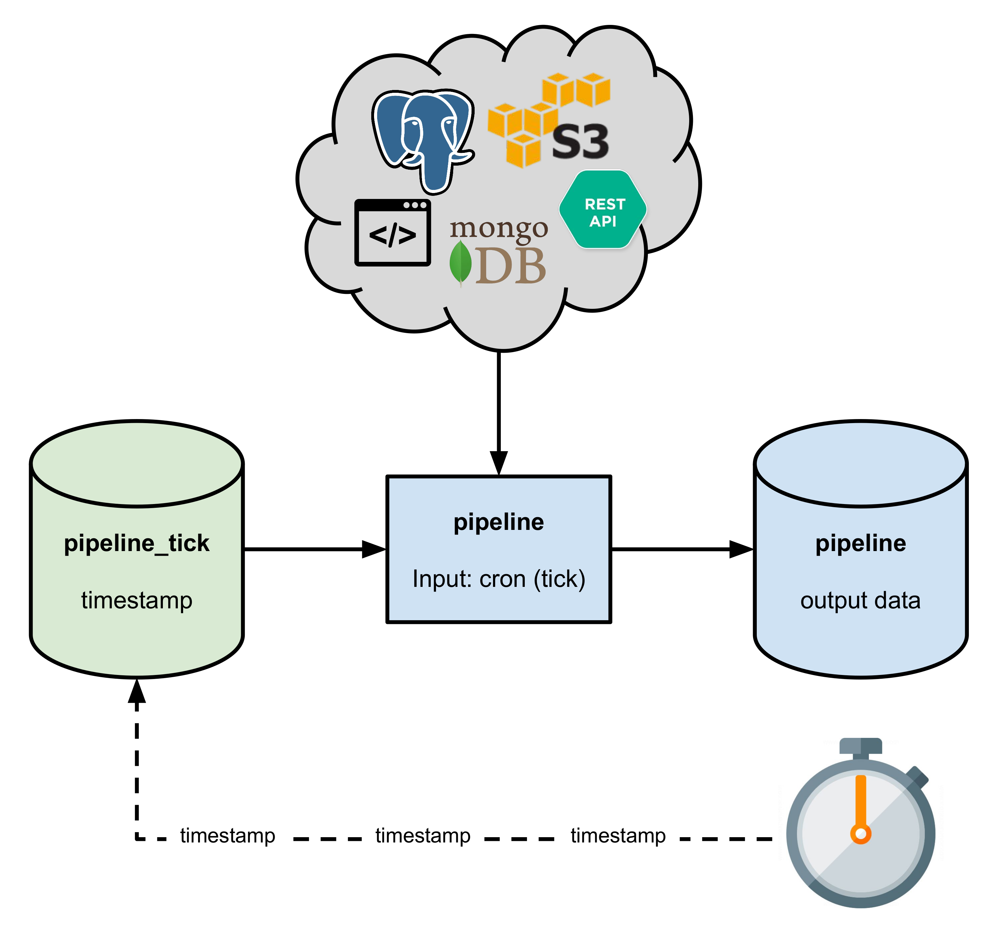

# Cron Pipeline

Pachyderm triggers pipelines when new changes appear in the input repository.
However, if a pipeline consumes data from sources outside of Pachyderm,
it cannot use Pachyderm's triggering mechanism to process updates from
those sources. A standard pipeline with a PFS input might not satisfy
the requirements of the following tasks:

- Scrape websites
- Make API calls
- Query a database
- Retrieve a file from a location accessible through an S3 protocol
or a File Transfer Protocol (FTP).

You can schedule such pipelines to run periodically by using the Pachyderm's
built-in `cron` PFS input type.

A minimum cron pipeline must include the following parameters:

| Parameter  | Description  |
| ---------- | ------------ |
| `"name"`   | A descriptive name of the cron pipeline. |
| `"spec"`   | An interval between scheduled cron jobs. You can specify any value that is <br> formatted according to [RFC 3339](https://www.ietf.org/rfc/rfc3339.txt). <br> For example, if you set `*/10 * * * *`, the pipeline runs every ten minutes. |

## Example of a Cron Pipeline

For example, you want to query a database every ten seconds and update your
dataset with the new data every time the pipeline is triggered. The following
pipeline extract illustrates how you can specify this configuration:

```
  "input": {
    "cron": {
      "name": "tick",
      "spec": "@every 10s"
    }
  }
```

When you create this pipeline, Pachyderm creates a new input data repository
that corresponds to the `cron` input. Then, Pachyderm automatically commits
a timestamp file to the `cron` input repository every ten seconds, which
triggers the pipeline.



The pipeline runs every ten seconds, queries the database and updates its
output. By default, Pachyderm runs the pipeline on the input data that was
added since the last tick and skips the already processed data.
However, if you need to reprocess all the data, you can set the `overwrite`
flag to `true` to overwrite the timestamp file on each tick.
Because the processed data is associated with the old file, its absence indicates
that the data needs to be reprocessed.

**Example:**

```
  "input": {
    "cron": {
      "name": "tick",
      "spec": "@every 10s",
      "overwrite": true
    }
  }
```

**See Also:**

- [Periodic Ingress from MongoDB](https://github.com/pachyderm/pachyderm/tree/master/examples/db)
