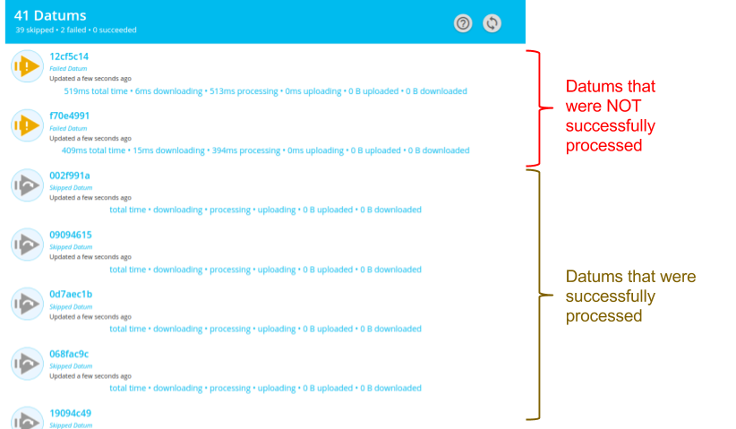

# Datum Metadata

Datum metadata provides the following information for any datums
processed by your pipelines:

- The amount of data that was uploaded and downloaded
- The time spend uploading and downloading data
- The total time spend processing
- Success/failure information, including any error encountered for failed datums
- The directory structure of input data that was seen by the job.

The primary and recommended way to view this information is via the
Pachyderm Enterprise dashboard. However, the same information is
available through the `pachctl inspect datum` and `pachctl list datum`
commands or through their language client equivalents.

## Retrieving Datum Metadata Directly

Once a pipeline has finished a job, you can access metadata about the datums
processed during that job in the associated meta [system repo](../../reference/system_repos.md).

!!! example

    ```shell
    pachctl list file edges.meta@master
    ```

    **System response:**

    ```shell
    NAME   TAG TYPE SIZE
    /meta/     dir  1.956KiB
    /pfs/      dir  371.9KiB
    ```

The meta directory holds each datum's JSON metadata, and can be accessed using a `get file``:

!!! example

    ```shell
    pachctl get file edges.meta@master:/meta/002f991aa9db9f0c44a92a30dff8ab22e788f86cc851bec80d5a74e05ad12868/meta | jq
    ```

    **System response:**

    ```shell
    {
      "job": {
        "pipeline": {
          "name": "edges"
        },
        "id": "efca9595bdde4c0ba46a444a5877fdfe"
      },
      "inputs": [
        {
          "fileInfo": {
            ...
        }
      ],
      "hash": "28e6675faba53383ac84b899d853bb0781c6b13a90686758ce5b3644af28cb62f763",
      "stats": {
        "downloadTime": "0.103591200s",
        "processTime": "0.374824700s",
        "uploadTime": "0.001807800s",
        "downloadBytes": "80588",
        "uploadBytes": "38046"
      },
      "index": "1"
    }
    ```

The pfs directory has both the input and the output data that was committed in this datum:

!!! example

    ```shell
    pachctl list file edges@stats:/002f991aa9db9f0c44a92a30dff8ab22e788f86cc851bec80d5a74e05ad12868/pfs
    ```

    **System response:**

    ```shell
    NAME                                                                         TYPE SIZE
    /002f991aa9db9f0c44a92a30dff8ab22e788f86cc851bec80d5a74e05ad12868/pfs/images dir  78.7KiB  
    /002f991aa9db9f0c44a92a30dff8ab22e788f86cc851bec80d5a74e05ad12868/pfs/out    dir  37.15KiB
    ```

## Accessing Stats Through the Dashboard

If you have deployed and activated the Pachyderm Enterprise
Edition, you can explore advanced statistics through the dashboard. For example, if you
navigate to the `edges` pipeline, you might see something similar to this:


In this example case, you can see that the pipeline has 1 recent successful
job and 2 recent job failures. Pachyderm advanced stats can be very helpful
in debugging these job failures. When you click on one of the job failures,
can see general stats about the failed job, such as total time, total data
upload/download, and so on:


To get more granular per-datum stats, click on the `41 datums total`, to get
the following information:



You can identify the exact datums that caused the pipeline to fail, as well
as the associated stats:

- Total time
- Time spent downloading data
- Time spent processing
- Time spent uploading data
- Amount of data downloaded
- Amount of data uploaded
