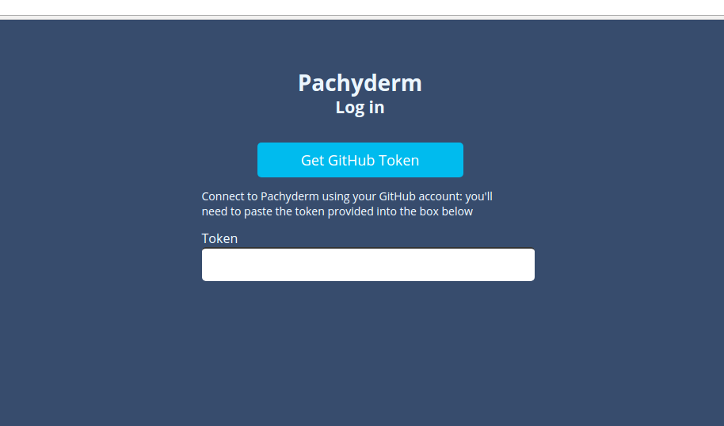
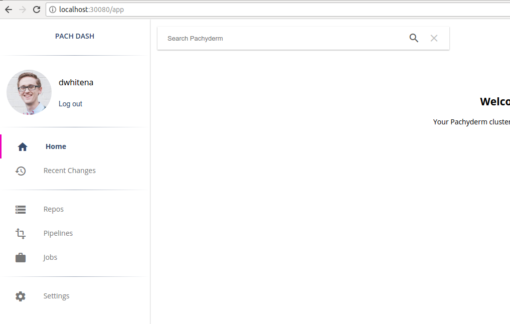
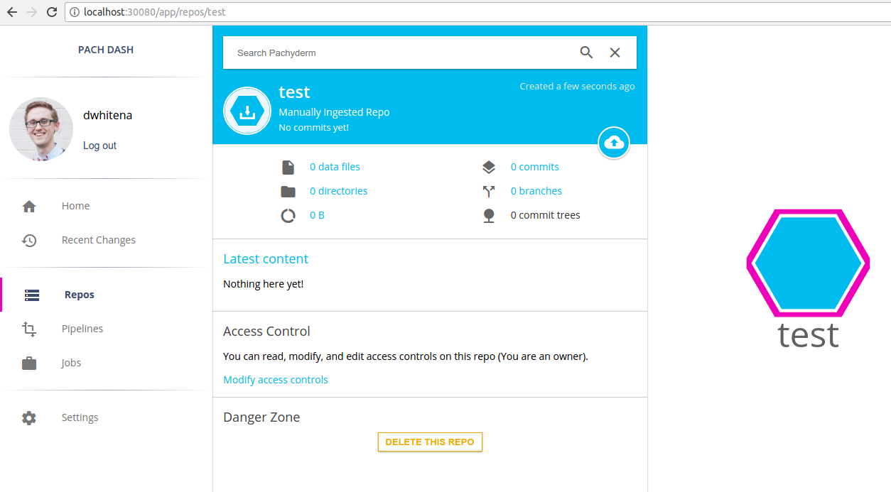

# Understanding Pachyderm access controls

If access controls are activated, each data repository, or repo,
in Pachyderm has an Access Control List (ACL) associated with it.
The ACL includes:

- `READERs` - users who can read the data versioned in the repo.
- `WRITERs` - users with `READER` access who can also submit
additions, deletions, or modifications of data into the repo.
- `OWNERs` - users with READER and WRITER access who can also
modify the repo's ACL.

Pachyderm defines the following account types:

* **GitHub user** is a user account that is associated with
a GitHub account and logs in through the GitHub OAuth flow. If you do not
use any third-party identity provider, you use this option. When a user tries
to log in with a GitHub account, Pachyderm verifies the identity and
sends a Pachyderm token for that account.
* **Robot user** is a user account that logs in with a pach-generated authentication
token. Typically, you create a user in simplified workflow scenarios, such
as initial SAML configuration.
* **Pipeline** is an account that Pachyderm creates for
data pipelines. Pipelines inherit access control from its creator.
* **SAML user** is a user account that is associated with a Security Assertion
Markup Language (SAML) identity provider.
When a user tries to log in through a SAML ID provider, the system
confirms the identity, associates
that identity with a SAML identity provider account, and responds with
the SAML identity provider token for that user. Pachyderm verifies the token,
drops it, and creates a new internal token that encapsulates the information
about the user.

By default, Pachyderm defines one hardcoded group called `admin`.
Users in the `admin` group can perform any
action on the cluster including appointing other admins.
Furthermore, only the cluster admins can manage a repository
without ACLs.

## Enabling access control

Before you enable access controls, make sure that
you have activated Pachyderm Enterprise Edition
as described in [this guide](./deployment.html).

To enable access controls, complete the following steps:

1. Verify the status of the Enterprise
features by opening the Pachyderm dashboard in your browser or
by running the following `pachctl` command:

   ```
   $ pachctl enterprise get-state
   ACTIVE
   ```

1. Activate the Enterprise access control features by completing
the steps in one of these sections:

   * [Activating Access Control with the Dashboard](#activating-access-controls-with-the-dashboard)
   * [Activating Access Control with pachctl](#activating-access-controls-with-pachctl)

### Activating access controls with the dashboard

To activate access controls in the Pachyderm dashboard,
complete the following steps:

1. Go to the Settings page.
1. Click the **Activate Access Controls** button.
After you click the button, Pachyderm enables you to add GitHub users
as cluster admins and activate access control:


After activating access controls, you should see the following screen
that asks you to log in to Pachyderm:



### Activating access controls with `pachctl`

To activate access controls with `pachctl`, choose one of these options:


1. Activate access controls by specifying an initial admin user:

   ```bash
   $ pachctl auth activate --initial-admin=<prefix>:<user>
   ```
  **Note:** You must prefix the username with the appropriate account
  type, either `github:<user>` or `robot:<user>`. If you select the
  latter, Pachyderm generates and returns a Pachyderm auth token
  that might be used to authenticate as the initial robot admin by using
  `pachctl auth use-auth-token`. You can use this option when
  you cannot use GitHub as an identity provider.


1. Activate access controls with a GitHub account:

   ```bash
   $ pachctl auth activate
   ```

   Pachyderm prompts you to log in with your GitHub account. The
   GitHub account that you sign in with is the only admin until
   you add more by running `pachctl auth modify-admins`.

## Logging in to Pachyderm

After you activate access controls, log in to your cluster either
through the dashboard or CLI. The CLI and the dashboard have
independent login workflows:

- [Log in to the dashboard](#log-in-to-the-dashboard).
- [Log in to the CLI](#log-in-to-the-cli).

### Log in to the dashboard

After you have activated access controls for Pachyderm, you
need to log in to use the Pachyderm dashboard as shown above
in [this section](#activating-access-controls-with-the-dashboard).

To log in to the dashboard, complete the following steps:

1. Click the **Get GitHub token** button. If you
have not previously authorized Pachyderm on GitHub, an option
to **Authorize Pachyderm** appears. After you authorize
Pachyderm, a Pachyderm user token appears:


1. Copy and paste this token back into the Pachyderm login
screen and press **Enter**. You are now logged in to Pachyderm,
and you should see your GitHub avatar and an indication of your
user in the upper left-hand corner of the dashboard:




### Log in to the CLI

To log in to `pachctl`, complete the following steps:

1. Type the following command:

   ```bash
   pachctl auth login
   ```

   When you run this command, `pachctl` provides
   you with a GitHub link to authenticate as a
   GitHub user.

   If you have not previously authorized Pachyderm on GitHub, an option
   to **Authorize Pachyderm** appears. After you authorize Pachyderm,
   a Pachyderm user token appears:

   

1. Copy and paste this token back into the terminal and press enter.

   You are now logged in to Pachyderm!

   1. Alternatively, you can run the command:

      ```bash
      pachctl auth use-auth-token
      ```

   1. Paste an authentication token recieved from
      `pachctl auth activate --initial-admin=robot:<user>` or
      `pachctl auth get-auth-token`

## Manage and update user access

You can manage user access in the UI and CLI.
For example, you are logged in to Pachyderm as the user `dwhitena`
and have a repository called `test`.  Because the user `dwhitena` created
this repository, `dwhitena` has full `OWNER`-level access to the repo.
You can confirm this in the dashboard by navigating to or clicking on
the repo `test`:




Alternatively, you can confirm your access by running the
`pachctl auth get ...` command.

**Example:**

```
$ pachctl auth get dwhitena test`
OWNER
```

An OWNER of `test` or a cluster admin can then set other user’s
level of access to the repo by using
the `pachctl auth set ...` command or through the dashboard.

For example, to give the GitHub users `JoeyZwicker` and
`msteffen` `READER`, but not `WRITER` or `OWNER`, access to
`test` and `jdoliner` `WRITER`, but not `OWNER`, access,
click on **Modify access controls** under the repo details
in the dashboard. This functionality allows you to add
the users easily one by one:


## Behavior of pipelines as related to access control

In Pachyderm, you do not explicitly grant users access to
pipelines. Instead, pipelines infer access from their input
and output repositories. To update a pipeline, you must have
at least `READER`-level access to all pipeline inputs and at
least `WRITER`-level access to the pipeline output. This is
because pipelines read from their input repos and write
to their output repos, and you cannot grant a pipeline
more access than you have yourself.

- An `OWNER`, `WRITER`, or `READER` of a repo can subscribe a
pipeline to that repo.
- When a user subscribes a pipeline to a repo, Pachyderm sets
that user as an `OWNER` of that pipeline's output repo.
- If additional users need access to the output repository,
the initial `OWNER` of a pipeline's output repo, or an admin,
needs to configure these access rules.
- To update a pipeline, you must have `WRITER` access to the
pipeline's output repos and `READER` access to the
pipeline's input repos.


## Manage the Activation Code

When an enterprise activation code expires, an auth-activated
Pachyderm cluster goes into an `admin-only` state. In this
state, only admins have access to data that is in Pachyderm.
This safety measure keeps sensitive data protected, even when
an enterprise subscription becomes stale. As soon as the enterprise
activation code is updated by using the dashboard or CLI, the
Pachyderm cluster returns to its previous state.

When you deactivate access controls on a Pachyderm cluster
by running `pachctl auth deactivate`, the cluster returns
its original state that including the
following changes:

- All ACLs are deleted.
- The cluster returns to being a blank slate in regards to
access control. Everyone that can connect to Pachyderm can access
and modify the data in all repos.
- No users are present in Pachyderm, and no one can log in to Pachyderm.
