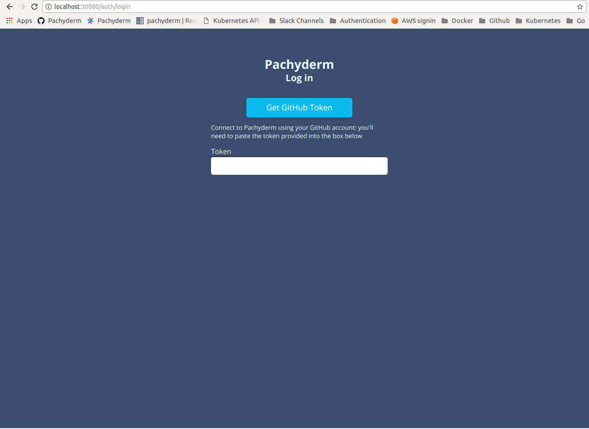
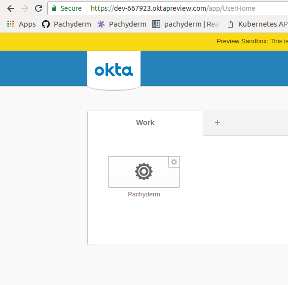
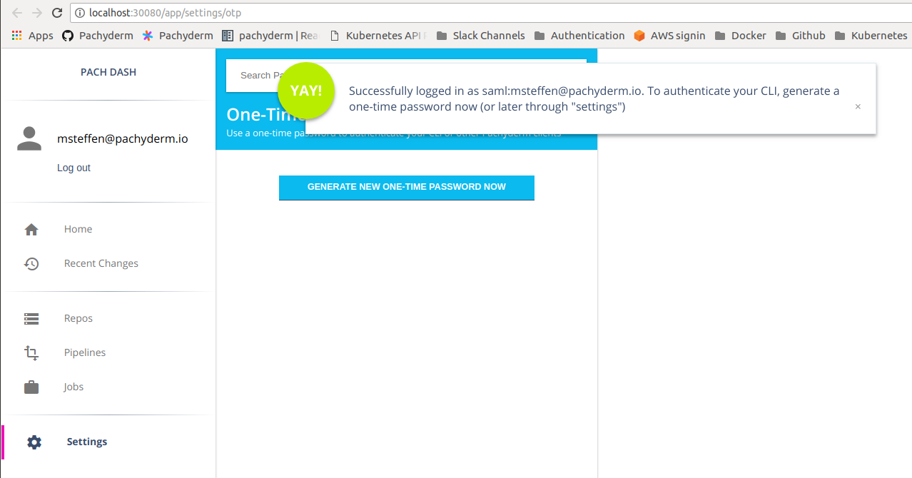
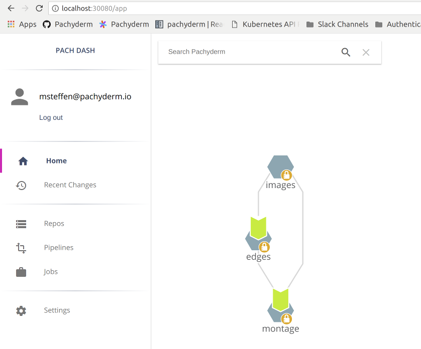
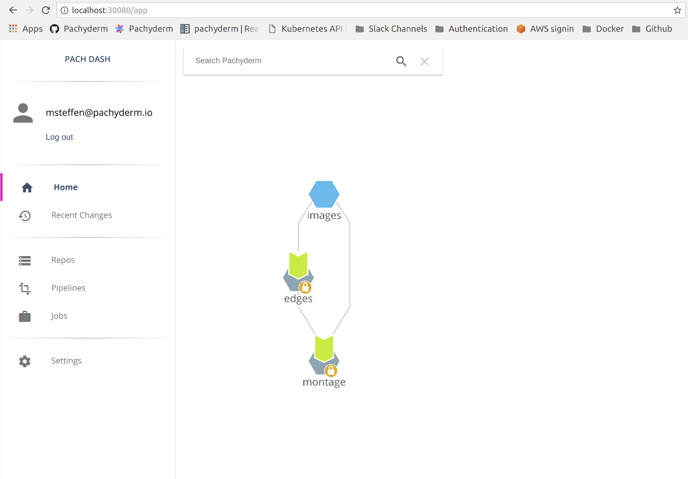
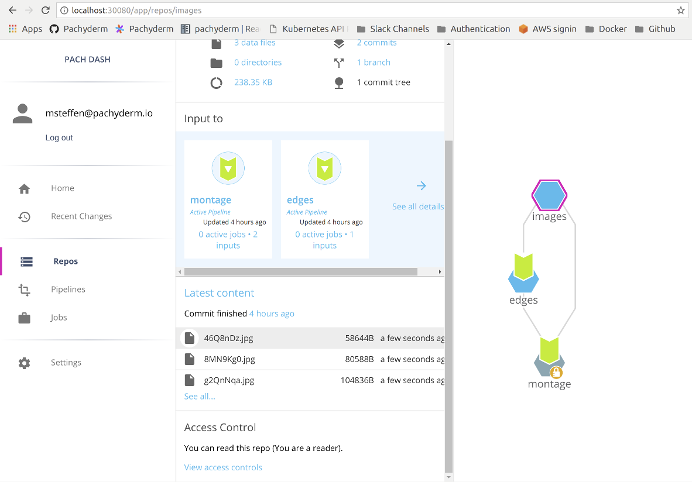
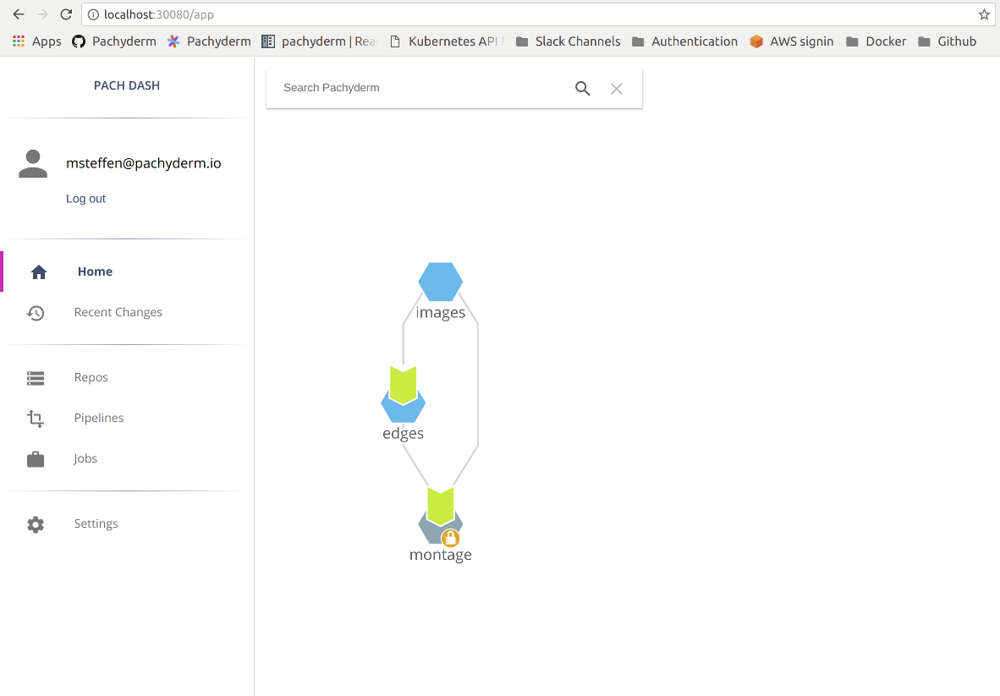
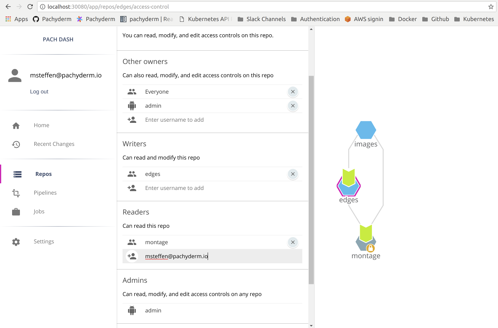

# Manage access

This section walks you through an example of configuring
Pachyderm authentication with an ID provider and
setting up permissions for other users,
including the following topics:

1. Authenticating by using a SAML ID provider.
1. Authenticating in the CLI.
1. Authorizing a user or group to access data.

Before completing the tasks in this section, configure Pachyderm
authentication and an ID provider
as described in in [Seting up SAML](saml.html).

Walk through the [Creating an OpenCV pipeline](../examples/opencv/README.md)
example or by following the steps below.

To complete this example in CLI, follow these steps:

1. In the CLI, log in as a cluster admin:

   ```bash
   (admin)$ pachctl auth use-auth-token
   Please paste your Pachyderm auth token:
   <auth token>
   ```

1. Verify that you have been successfully authenticated:

   ```bash
   (admin)$ pachctl auth whoami
   You are "robot:admin"
   You are an administrator of this Pachyderm cluster
   ```

1. Complete the OpenCV example:

   1. Create a repository called `images`:

      ```bash
      (admin)$ pachctl create repo images
      ```
   1. Create the `edges.json` and `montage.json` pipelines:

      ```bash
      (admin)$ pachctl create pipeline -f examples/opencv/edges.json
      (admin)$ pachctl create pipeline -f examples/opencv/montage.json
      ```

   1. Put the `images` and `image2` files to the `images` repository:

      ```bash
      (admin)$ pachctl put file images@master -i examples/opencv/images.txt
      (admin)$ pachctl put file images@master -i examples/opencv/images2.txt
      ```

   1. View the list of repositories:

      ```bash
      (admin)$ pachctl list repo
      NAME    CREATED       SIZE (MASTER) ACCESS LEVEL
      montage 2 minutes ago 1.653MiB      OWNER
      edges   2 minutes ago 133.6KiB      OWNER
      images  2 minutes ago 238.3KiB      OWNER
      ```

   1. View the list of jobs:

      ```bash
      (admin)$ pachctl list job
      ID                               OUTPUT COMMIT                            STARTED       DURATION  RESTART PROGRESS  DL       UL       STATE
      023a478b16e849b4996c19632fee6782 montage/e3dd7e9cacc5450c92e0e62ab844bd26 2 minutes ago 8 seconds 0       1 + 0 / 1 371.9KiB 1.283MiB success
      fe8b409e0db54f96bbb757d4d0679186 edges/9cc634a63f794a14a78e931bea47fa73   2 minutes ago 5 seconds 0       2 + 1 / 3 181.1KiB 111.4KiB success
      152cb8a0b0854d44affb4bf4bd57228f montage/82a49260595246fe8f6a7d381e092650 2 minutes ago 5 seconds 0       1 + 0 / 1 79.49KiB 378.6KiB success
      86e6eb4ae1e74745b993c2e47eba05e9 edges/ee7ebdddd31d46d1af10cee25f17870b   2 minutes ago 4 seconds 0       1 + 0 / 1 57.27KiB 22.22KiB success
      ```

## Authenticate by using the UI

Before you authenticate, opening the dashboard results in a blank screen:



Before completing the steps in this section, you must have a SAML IDP
configured.

To authenticate by using a SAML ID provider, follow the steps below:

1. In the ID provider UI, find your Pachyderm cluster and sign in.



1. After you authenticate, the browser redirects you to the
Pachyderm dashboard. The redirect URL is configured in the
Pachyderm auth system.

1. (Optional) Generate a one-time password (OTP). You can also do this
later from the **Settings** panel.



1. After you close the OTP panel, the Pachyderm cluster displays. You
might not have access to any of the repos inside the cluster. A repo that you
cannot read is indicated by a lock symbol.



## Authenticate by using the CLI

After you authenticate in the dashboard, you can generate an OTP and
sign in to the CLI. You can also generate an OTP from the **Settings**
panel:


**Example:**

```bash
(user)$ pachctl auth login --code auth_code:73db4686e3e142508fa74aae920cc58b
(user)$ pachctl auth whoami
You are "saml:msteffen@pachyderm.io"
session expires: 14 Sep 18 20:55 PDT
```

Based on the configuration that you have set up in [Configure a SAML application](saml_setup.md),
a SAML session expires after eight hours. You can modify the duration of
sessions in the Pachyderm auth config file. For security reasons, keep
SAML sessions relatively short because SAML group memberships are only
updated when users sign in. If you remove a user from a group, they can
still access the group's resources until their session expires.

## Authorize a user or group to access data

An admin can grant other users access to data.

To grant access to data to other users, complete the following steps:

1. Authorize the user `msteffen@pachyderm.io` read access to the `images`
repository:

   ```bash
   (admin)$ pachctl auth set saml:msteffen@pachyderm.io reader images
   ```

   The `images` repo is no longer locked when the user
   `msteffen@pachyderm.io` views it in the dashboard:

   

1. Click on the `images` repo to preview the data that is stored inside:

   

1. If your SAML ID provider supports group attributes, you can configure
access for groups by supplying the name of the group in the `pachctl auth set`
command. The following example grants owner access to the `edges` repository
to the `Everyone` group:

   ```bash
   (admin)$ pachctl auth set group/saml:Everyone owner edges
   ```

   The edges repo is now unlocked:

   

   Because `msteffen@pachyderm.io` has `OWNER` privileges in the `edges` repo
   through the `Everyone` group, they can modify the ACL for `edges`.
   `msteffen@pachyderm.io` can use `OWNER` privileges in the `Everyone` group
   to add themselves directly to `edges` ACL:

   

   To view this change in the CLI, run the following command:

   ```
   (admin)$ pachctl auth get edges
   pipeline:edges: WRITER
   pipeline:montage: READER
   group/saml:Everyone: OWNER
   saml:msteffen@pachyderm.io: READER
   robot:admin: OWNER
   ```
