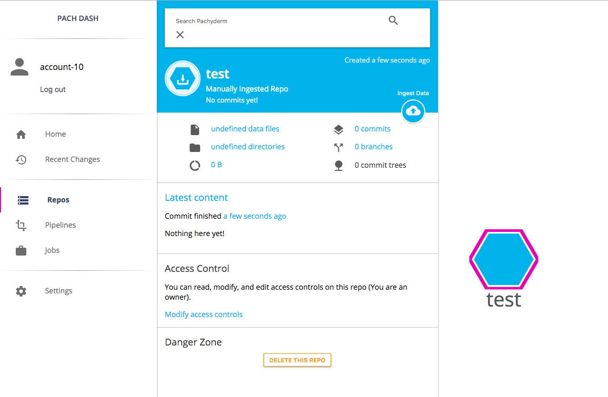

# Getting Started with Pachyderm Hub

Pachyderm Hub is a platform for data scientists where you can
version-control your data, build analysis pipelines, and
track the provenance of your data science workflow.

This section walks you through
the steps of creating a cluster in Pachyderm Hub so that
you do not need to worry about the underlying infrastructure
and can get started using Pachyderm right away.

<!--Follow the steps below to configure your first Pachyderm pipeline or
watch the 2-minute [Getting Started Screencast](../tutorials/screencast-opencv.html).-->

Pachyderm Hub enables you to preview Pachyderm functionality
free of charge by removing the burden of deploying Pachyderm locally
or in a third-party cloud platform. Currently, Pachyderm Hub is in beta
so clusters cannot be turned into production clusters and should only
be used for easy development and testing. Production-grade functionality
will be supported in later releases.

**Note:** We'd like to hear your feedback! Let us know what you think
about Pachyderm Hub and help us make it better.
Join our [Slack channel](slack.pachyderm.io).

## How it Works

To get started, complete the following steps:


## Log in

Pachyderm Hub uses GitHub OAuth as an identity provider. Therefore,
to start using Pachyderm Hub, you need to log in by authorizing
Pachyderm Hub with your GitHub account. If you do not
have a GitHub account yet, create one by following the steps described
in [Join GitHub](https://github.com/join).

To log in to Pachyderm Hub, complete the following steps:

1. Go to [hub.pachyderm.com](https://hub.pachyderm.com).
1. Click **Try for free**.
1. Authorize Pachyderm Hub with your GitHub account by typing your
   GitHub user name and password.
1. Proceed to [Step 1](#step-1-create-a-cluster).

## Step 1: Create a Cluster

To get started, create a Pachyderm cluster on which your pipelines will run.
A Pachyderm cluster runs on top of the underlying cloud infrastructure.
In Pachyderm Hub, you can create a one-node cluster that you can use for
a limited time.

To create a Pachyderm cluster, complete the following steps:

1. If you have not yet done so, log in to Pachyderm Hub.
1. Click **Create**.
1. Type a name for your cluster. For example, `test1`.
1. Click **Create**.

   Your cluster is provisioned instantly!

   

   **Note:** Pachyderm has a set number of pre-warmed clusters.
   If you see your cluster is in a *starting* state, you might
   have to wait a few minutes for it to be ready.

1. Proceed to [Step 2](#step-2-connect-to-your-cluster).

## Step 2 - Connect to Your Cluster

Pachyderm Hub enables you to access your cluster through a command-line
interface (CLI) called `pachctl` and the web interface called the Dashboard.
Although you can perform most simple actions directly in the dashboard,
`pachctl` provides full functionality. Most likely, you will use
`pachctl` for any operation beyound the most basic workflow.
recommends that you use `pachctl` for all data operations and
the dashboard to view your data and graphical representation of your
pipelines.

After you create a cluster, you need to go to the terminal on your computer
and configure your CLI to connect to your cluster by installing `pachctl`
and configuring your Pachyderm context. For more information about
Pachyderm contexts, see [Connect by using a Pachyderm Context](https://docs.pachyderm.io/en/latest/deployment/connect-to-cluster.html#connect-by-using-a-pachyderm-context).

Your `pachctl` version must match the version of the Pachyderm cluster that
you deployed on Pachyderm Hub. Pachyderm Hub uses the latest release
of Pachyderm so we recommend that you use the same version for `pachctl`.

To set the correct Pachyderm context, you need to use the hostname
of your cluster that is available in the Pachyderm Hub UI under **Connect**.

**Note:** `kubectl` commands are not supported for the clusters deployed
on Pachyderm Hub.

To connect to your cluster, complete the following steps:

1. On your local computer, open a terminal window.
1. Install `pachctl` for your platform. For example, if you are using
   macOS, run:

   ```bash
   $ brew tap pachyderm/tap && brew install pachyderm/tap/pachctl@1.9
   ```

   If you are using another operating system, see
   [Install `pachctl`](../getting_started/local_installation.html#install-pachctl).

   * If you already have `pachctl` installed, skip this step, or you
   might need to update your version of `pachctl`. For example, if you use
   macOS and `brew`, run:

   ```bash
   $ brew upgrade pachyderm/tap/pachctl@1.9
   ```

1. Verify your `pachctl` version:

   ```bash
   $ pachctl version --client-only
   1.9.7
   ```

1. Configure a Pachyderm context and log in to your
   cluster by using a one-time authentication token:

   1. In the Pachyderm Hub UI, click **Connect** next to your cluster.
   1. Copy, paste, and run the commands in the instructions in your terminal.
      These commands create  a new Pachyderm context with your cluster
      details on your machine.

      **Note:** If you get the following error, that means that your authentication
      token has expired:

      ```bash
      error authenticating with Pachyderm cluster: /pachyderm_auth/auth-codes/ e14ccfafb35d4768f4a73b2dc9238b365492b88e98b76929d82ef0c6079e0027 not found
      ```

      To get a new token, refresh the page. Then, use
      the new token to authenticate.

   1. Verify that you have set the correct context:

      ```bash
      $ pachctl config get active-context
      ```

1. Verify that you can run `pachctl` commands on your cluster:

   1. Create a repo called `test`:

      ```bash
      $ pachctl create repo test
      ```

   1. Verify that the repo was created:

      ```bash
      $ pachctl list repo
      NAME   CREATED       SIZE (MASTER) ACCESS LEVEL
      test   3 seconds ago 0B            OWNER
      ```

   1. Go to the dashboard and verify that you can see the repo in the
      dashboard:

      

## Next Steps

Congratulations! You have successfully deployed and configured a Pachyderm
cluster in Pachyderm Hub. Now, you can try out our Beginners tutorial that walks
you through the Pachyderm basics.

* [Beginner Tutorial](../getting_started/beginner_tutorial.html)
